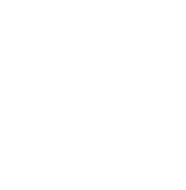

  

OpenVT is software for 2D Vtubing with a focus on Linux availability

### Supported Trackers

- OpenSeeFace (Separate executable required)
- VTubeStudio (TCP over Wi-fi)

### Differences from Alternatives

- native Linux support
- open source development allowing for community driven feature delivery 
- transparent window support to simplify alpha based capture in OBS
- adjustable filtering settings, allowing for sharper scaling of pixel art models
- multi-window popout controls

### VTube Studio Compatibility

OpenVT strives to be largely compatible with [VTubeStudio](https://denchisoft.com/), the premier software for [Live2D](https://www.live2d.com/en/) based tracking for Vtubing.  
Models can be used between the two, sharing the same files without need to make adjustments.  Any OpenVT specific settings are kept separately to avoid possible collisions with namespacing. 
Whenever possible, VTubeStudio will still be respected as the standard.  OpenVT exists not as a competitor, but as a mostly drop-in alternative to serve a niche that is not directly supported..

Feature parity with VTS is a goal, excluding more complex features such as plugin compatibility, and VNet.

## How is it Built?

The majority of the vtuber ecosystem is built in Unity largely due to familiarity of the software for 3D applications and the available, well documented, first-party support Live2D by Cubism.
By contrast, OpenVT is built in Godot, leveraging much of the same open-source software for facial tracking, and native libraries for controlling models.  The application is designed to be easy to use and provide a consistent experience for streaming across operating systems, with Linux desktop support being a top priority.

### Guidelines

OpenVT attempts to use as much out of the box functionality of Godot as possible with low overhead and dependencies, as it's already a rather feature rich runtime.
As such, GDScript is the primary language of the codebase.

Using the base version of at least Godot 4.6 will be enough to edit the project.
Be sure to grab the export templates if you wish to export standalone binaries.

### Building Dependencies

This should be done before attempting to open or run the project, otherwise Godot will complain about missing files and classes.

Please follow the readmes and build instructions of any git submodules included in the [thirdparty/](./thirdparty) directory to know of any specifics.  Some dependencies may require manually acquiring proprietary binaries, requiring the developer to agree to terms separate from OpenVT.

Git submodules are not expected to change frequently.  Building the dependencies will generally only need to be done once for most developers.

The provided [build_dependencies.sh](./build_dependencies.sh) script is designed to build each submodule and move its outputs to the required locations in the project filesystem for openvt to run.

## References

- https://github.com/DenchiSoft/VTubeStudio
- https://github.com/emilianavt/OpenSeeFace
- https://www.live2d.com/en/
- https://github.com/MizunagiKB/gd_cubism
- https://github.com/Live2D/CubismNativeFramework

OpenVT Mascot by @erodozer

## Licensing

Additional licenses are found in the [/license](./license) directory.

Functionality relating to rendering Live2D models depends on the Live2D Cubism SDK, a copyrighted work developed by Live2D Inc.

Any licensing agreements are non-transferrable to any forks and non-official distributions of OpenVT.
